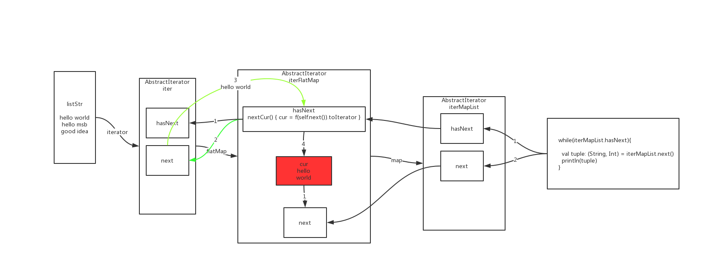

# 集合使用(具体代码见lesson03类)
## scala使用java中的集合
```scala
    val listJava = new util.LinkedList[String]()
    listJava.add("hello")
```

## scala使用自己的集合
```scala
    //1.数组
    //Java中泛型是<>  scala中是[]，所以数组用（n）
    //  val 约等于 final  不可变描述的是val指定的引用的值（值：字面值，地址）
    val arr01 = Array[Int](1,2,3,4)
//    arr01=Array(1,2,3,3,3,3)
    arr01(1)=99
    println(   arr01(0)  )

    for (elem <- arr01) {
      println(elem)
    }
    //遍历元素，需要函数接收元素
    arr01.foreach(println)
```

## 使用list
```scala
    println("--------------list-------------")
    //2.链表
    //scala中collections中有个2个包：immutable，mutable  默认的是不可变的immutable
    val list01 = List(1,2,3,4,5,4,3,2,1)
    for (elem <- list01) {
      println(elem)
    }
    list01.foreach(println)
// 不可变集合不能使用.+=
//    list01.+=(22)

    val list02 = new ListBuffer[Int]()
    list02.+=(33)
    list02.+=(34)
    list02.+=(35)

    //TODO:学习  scala数据集中的  ++ +=  ++：  ：++
    // ++ 用于连接两个集合，println(list ++ list2)
    // += 向集合尾部插入单个值
    // ++: 使用 println(List(10) ++: Vector(10)) 打印Vector(10, 10)
    // 解释 ++ ++:当操作数是不同类型的集合时，返回不同的结果。++返回与左侧相同的集合类型，并++:返回与右侧相同的集合类型
    // :++    还没研究出来
list02.foreach(println)
```

## map使用
```scala
    println("--------------map-------------")
    val map01: Map[String, Int] = Map( ("a",33) ,  "b"->22  ,("c",3434),("a",3333)  )
    val keys: Iterable[String] = map01.keys
    
    // option相当于java中的optional 如果元素一定存在用map01.get(key).get来取值
    // 否则map01.get("a").getOrElse("hello world")这样取值，这样可以避免在代码里面做空指针判断
    
    //option: none  some  
    println(map01.get("a").get)
//    println(map01.get("w").get)


    println(map01.get("a").getOrElse("hello world"))
    println(map01.get("w").getOrElse("hello world"))
    for (elem <- keys) {
      println(s"key: $elem   value: ${map01.get(elem).get}")
    }

//    keys.foreach()

    val map02: mutable.Map[String, Int] = scala.collection.mutable.Map(("a",11),("b",22))
    map02.put("c",22)
```

## 对集合中元素进行映射
```scala
    val list = List(1,2,3,4,5,6)

    list.foreach(println)

    val listMap: List[Int] = list.map( (x:Int) => x+10  )
    listMap.foreach(println)
    val listMap02: List[Int] = list.map(  _*10 )

    list.foreach(println)
    listMap02.foreach(println)
```
## 扁平化映射
```scala
    println("--------------艺术-升华------------")

    val listStr = List(
      "hello world",
      "hello msb",
      "good idea"
    )
//        val listStr = Array(
//      "hello world",
//      "hello msb",
//      "good idea"
//    )
//        val listStr = Set(
//      "hello world",
//      "hello msb",
//      "good idea"
//    )

    // 将集合每个元素按照空格切分
    val flatMap= listStr.flatMap(  (x:String)=> x.split(" ") )
    flatMap.foreach(println)
    // 切分后变成一个map,key的值固定为1，如果方法签名和方法体中参数的使用顺序可以使用_代替
    val mapList = flatMap.map( (_,1) )
    mapList.foreach(println)
```
## 迭代器的使用
]
```scala
    //以上代码有什么问题吗？  内存扩大了N倍，每一步计算内存都留有对象数据；有没有什么现成的技术解决数据计算中间状态占用内存这一问题~？
    //iterator！！！！！

    println("--------------艺术-再-升华------------")


    //基于迭代器的原码分析

    val iter: Iterator[String] = listStr.iterator  //什么是迭代器，为什么会有迭代器模式？  迭代器里不存数据！

    // 补充:
    // 如果每一个集合里面都维护一个迭代的指针，多线程访问同一个list的时候，比如第一个线程迭代到第3个位置，
    // 第2个线程开始迭代的时候也会从第3个开始，这样相互影响就会有问题，使用迭代器，迭代器内部只维护一个指针，不存数据，
    // 所以内存占用也会减少，不会出现上面每一步计算内存都留有对象数据

    val iterFlatMap= iter.flatMap(  (x:String)=> x.split(" ") )
    // iterFlatMap只能迭代一次，因为第一次迭代完指针就到最后一个元素了，如果这行不注释，再迭代迭代不出来
//    iterFlatMap.foreach(println)

    val iterMapList = iterFlatMap.map( (_,1) )

    while(iterMapList.hasNext){
      val tuple: (String, Int) = iterMapList.next()
      println(tuple)
    }


//    iterMapList.foreach(println)

    //1.listStr真正的数据集，有数据的
    //2.iter.flatMap  没有发生计算，返回了一个新的迭代器
```
